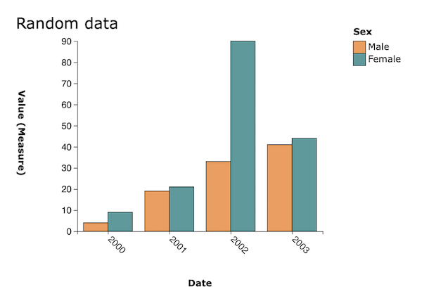

# d3-jsonstat-bar-chart
This is a (moderately) simple grouped bar chart. Once configured with data and
options, the x-axis, y-axis and z-axis (optionally for grouping) can be changed
at run-time and the chart redrawn to reflect changes.

Feedback on events is available for a range of interactions, and key elements of
the bar chart have CSS classes assigned to enable customisation.



## Example
The file `example.htm` contains a working example with data from an API (in this
case the Nomis API) and also from the `data.csv` file included with this project.

```
<div id="chart1"></div>
<script>
    var ds = null; // Get data and call JSONstat(...) on it.
    barchart1 = d3jsbc({
        data: ds,
        title: 'Title for the chart',
        x: 'gender',
        y: 'measures',
        z: 'time',
        width: 650,
        height: 450,
        target: 'chart1'
    });
</script>
```

## Options
When creating a bar chart, an `options` object must be specified with the following properties:

### `target`
Id of the target HTML element on the page into which the chart is to be rendered (string).

### `data`
Reference to a data object, created by passing data in JSON-stat format to the `JSONstat(...)`
function from the JSON-stat Toolkit (https://json-stat.com/).

### `title`
Title of the chart (string).

### `x`
Id of data dimension to place on the x-axis (string).

### `y`
Id of data dimension to place on the y-axis (string).

### `z` (optional)
Id of data dimension to place on the grouped z-axis (string).

### `yAxisFormat` (optional)
Format for labels on the y-axis (string, e.g. `,.0f`).

### `events` (optional)
This property contains an object that defines (optional) functions to call when
various events occur on the chart.

```
events: {
    bar: {
        click: function(data, index, element) { },
        mouseOver: function(data, index, element) { },
        mouseOut: function(data, index, element) { }
    },
    xAxisTitle: {
        click: function(data, element) { },
        mouseOver: function(data, element) { },
        mouseOut: function(data, element) { }
    },
    yAxisTitle: {
        click: function(data, element) { },
        mouseOver: function(data, element) { },
        mouseOut: function(data, element) { }
    },
    legendTitle: {
        click: function(data, element) { },
        mouseOver: function(data, element) { },
        mouseOut: function(data, element) { }
    },
    legendItem: {
        click: function(data, index, element) { },
        mouseOver: function(data, index, element) { },
        mouseOut: function(data, index, element) { }
    }
}
```

### `width` (optional)
Width of the chart in pixels (integer).
Default `660`.

### `height` (optional)
Height of the chart in pixels (integer).
Default `350`.

### `margin` (optional)
Margin around chart to allow space for axis labels and legend.
Default `{ top: 40, right: 150, bottom: 100, left: 100 }`.

### `colors` (optional)
Array of HEX color strings for bar fill colors.
Default `["#f59a54","#4e9b9d","#88608b","#cb9f20","#c68bc6"]`.

### `legendPadding` (optional)
Gap in pixels between right of chart and legend.
Default `50`.

### `zSpacing` (optional)
Distance in pixels space between groups of z-axis bars.
Default `10`.

### `animate` (optional)
Indicate if chart bars should have animation effects.
Default `true`.

### `dataset` (optional)
Index of dataset in JSON-stat data object (integer).
Default `0`.

## CSS Classes
The following CSS classes are allocated to the bar chart:

### Chart titles
* `chart-title`
* `legend-title`
* `x-axis-title`
* `y-axis-title`

### Axis
* `x`
* `y`
* `axis`

### Legend
* `legend`
* `legend-n` (where _n_ is index of legend)
* `legend-key`
* `legend-text`
* `chart-legend-inactive`
* `chart-legend-mouseover`

### Chart bars
* `chart-bar`
* `chart-bar-n` (where _n_ is index of bar in slice)
* `chart-bar-inactive`
* `chart-bar-mouseover`
* `slice` (groups z-axis bars together)

## Dependencies
* https://D3js.org - https://d3js.org/d3.v5.min.js
* https://json-stat.org - https://cdn.jsdelivr.net/npm/jsonstat